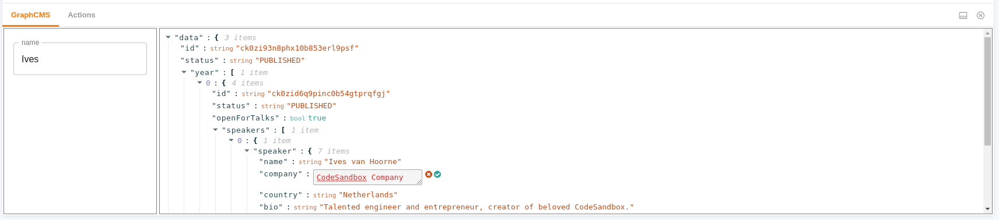

# Storybook Addon GraphCMS

[](https://storybook.js.org/)
[](https://graphql.org/)
[](https://graphcms.com/)

Write queries in the code, preview GraphQL data in a comfy way, pass response to your components

Read the [post on medium](https://medium.com/@focus-reactive/storybook-addon-graphcms-9d47e30371df)

## Why you want to use it

### 1. Develop components

Develop your components in isolation with actual backend stored data. With this addon you can add query to your stories and use fetched data as props for your components. You are flexible to use it with a single component or return an array of components - everything you need is just to write stories.

[live demo](https://usulpro.github.io/storybook-addon-graphcms/?path=/story/with-react-components--ram)


While you see your components in Storybook you can also inspect the query response in row JSON via addon Panel. You can even edit manually and temporrary override the result in order to quickly test your components with different values.



### 2. Browse database

You can simply use Storybook and this addon for rapid development of tools to browse your GraphQL endpoint. Just write the queries for data you want to show and it will be outputted as a table. If you have arrays, nested objects or images inside your query it will be turned to friendly visible form. Good for documenting things withing your team.

[live demo](https://usulpro.github.io/storybook-addon-graphcms/?path=/story/speakers--rdb)


### 3. Extend your GraphCMS UI

Same as previous but if you provide you project and view IDs it will be possible to open any entry for editing in your GraphCMS app.


[live demo](https://usulpro.github.io/storybook-addon-graphcms/?path=/story/events-react-amsterdam--pages)


## Quick Start

Clone ready to use boilerplate project. You can use it as a quick start for connecting to **any** GraphQL service. [Demo with Github GraphQL API](https://focusreactive.github.io/storybook-graphql-quick-start)

```shell
git clone https://github.com/focusreactive/storybook-graphql-quick-start.git
cd storybook-graphql-quick-start
yarn
yarn start
```

See details: https://github.com/focusreactive/storybook-graphql-quick-start

## Usage

Prerequisite: you need to have project with [installed](https://storybook.js.org/docs/guides/quick-start-guide/) Storybook

Install addon

```shell
yarn add --dev @focus-reactive/storybook-addon-graphcms
```

Add addon to your Storybook

```js
// addons.js

import "@focus-reactive/storybook-addon-graphcms/register";
```

Configure addon

```js
// config.js or in your stories.js
import { addDecorator } from '@storybook/react';
import { withGraphCMS } from "@focus-reactive/storybook-addon-graphcms";

addDecorator(
  withGraphCMS({
    endpoint: YOUR_GRAPHQL_ENDPOINT,
    token: YOUR_GRAPHQL_TOKEN,
    // only if using with GraphCMS
    projectId: YOUR_GRAPHCMS_PROJECT_ID,
    // only if using with GraphCMS
    stage: "master",
  })
);

```

Write stories

```js
// stories.js

import { QueryParams } from '@focus-reactive/storybook-addon-graphcms';

export default {
  title: 'Browse GraphQL',
};

// write a query in your preferred way
const query = /* GraphQL */ `
  query($conferenceTitle: ConferenceTitle, $eventYear: EventYear, $name: String) {
    result: speakers(
      where: {
        conferenceEvents_some: { year: $eventYear, conferenceBrand: { title: $conferenceTitle } }
        name_contains: $name
      }
    ) {
      id
      bio
      name
      talks {
        title
      }
      avatar {
        mimeType
        url
      }
    }
  }
`;

// In Storybook v.5 you can simply export you stories from `stories.js` files. You can use `storiesOf(...).add(...)` syntax if prefer
export const speakers = ({ graphQlResponse }) => {
  const data = graphQlResponse.result;
  return null;
  // or pass data to your components
};

// You need to pass parameters to your story
speakers.story = {
  name: 'Conference Speakers',
  parameters: QueryParams({
    query,
    vars: { conferenceTitle: 'React_Day_Berlin', eventYear: 'Y2019' },
    searchVars: { name: '' },
    viewId, // view ID only to point a view when using with GraphCMS
    isConnected: true,
  }),
};


```

Note some details here:

1. See how we return `null` from the story function. In this case the default UI will be used to display data in a table form. It's useful if you just want to quickly see the results of your request.
2. If you return a React Component from your story it will behave as regular Storybook story except the additional field in the `story context` passed to the function that will contain fetched data. You story will be rendered **only after** data will be successfully received, so `({ graphQlResponse: { result } })` always has result of your query.
3. You can pass variables in `vars` and `searchVars` fields to the query as you usually do for GraphQL requests. The difference of `searchVars` is that there will be input fields in the addon panel and users can use them for searching
4. Settings passed to `withGraphCMS` and to `QueryParams` are merged into one object before using. You can pass them in any order or even use only one of them. Just do it in the most convenient way for you

Instead of passing options to the story how it's shown above you can `import { Query } from '@focus-reactive/storybook-addon-graphcms';` and pass all options via this helper:

```js
import { Query } from '@focus-reactive/storybook-addon-graphcms';

export const speakers = Query({
  name: 'Conference Speakers',
  query,
  vars: { conferenceTitle: 'React_Day_Berlin', eventYear: 'Y2019' },
  searchVars: { name: '' },
  viewId,
});

```

It does totally the same but in more compact way, especially if you only want to have the default view.

## Demo

We created a simple tool based on this addon to extend GraphCMS App for our content editors:

https://usulpro.github.io/storybook-addon-graphcms/

Here we writing queries to control what exact entries should be listed in each folder. Editors can use input fields to find the specific entry. It's easy to display all needed information in front of user even if it contains nested fields. Each entry has a link to the GraphCMS app to start editing it.


## Features

1. You don't need to write `stories` or even use `React` if you only want to view the results of queries. It has convenient default UI to display your data.
2. Expands nested objects to display in flat table
3. Detects `url` fields with image sources and outputs them
4. Input fields for GraphQL variables in the addon panel
5. You can inspect and temporary override the response of your query in the addon panel
6. Handles GraphQL requests and renders story only with successfully received data
7. Works fine with any GraphQL endpoint but provides additional features for GraphCMS services


## API

You need to pass options to addon. You can pass them directly as story parameters, with `withGraphCMS` decorator or with `Query` helper.

```js

import { Query } from '../../addon/decorator'

export const pages = Query({ ...options });

```

### Common options for any GraphQL service:

`endpoint` - Your GraphQL/GraphCMS project endpoint

`token` - GraphQL/GraphCMS bearer token

`query` - your GraphQL query

`vars` - GraphQL variables

`searchVars` - GraphQL variables you will set in the addon panel

`getData: data => data.nested.objects` - function for switching to nested objects inside query response. (example: `data => data.year[0].speakers`)

### GraphCMS specific options:

`projectId` - your project id

`viewId` - The id of your system or custom view in GraphCMS UI

`stage` - stage

### Stories options

`name` - The name of the Story

`story` - Story functions (if you don't use Storybook origin syntax)

### Writing stories

When you writing stories with your own components you can access the raw query response alongside with parsed results:

```js

export const yourStory = ({ graphQlResponse }) => {
  // Result of your query. Usually what you want to use for components inside your App
  const data = graphQlResponse.result;
  // Array with information about fetched fields. The same that used for displaying default table
  const columns = graphQlResponse.columns;
  // Array of receiving objects. Works fine together with `columns` to output the parsed data
  const rows = graphQlResponse.rows;

  return data.map(props => <YouComponent {...props} />)
};
```

`graphQlResponse.columns` and `graphQlResponse.rows` are useful if you creating own tool to display your GraphQL data. Otherwise use `graphQlResponse.result`.


## Contributing

Any contribution are welcome to this project! Feel free to open an issue or start a PR.

To develop this project:

1. git clone
2. yarn
3. yarn start
4. open http://localhost:9009
5. the package code is located inside `addon` folder

## Credits

<div align="left" style="height: 16px;">Created with ❤︎ to <b>GraphCMS</b> and <b>GraphQL</b> community by <a href="https://twitter.com/UsulPro">Oleg Proskurin</a> at <a href="https://twitter.com/FocusReactive">FocusReactive</a>
</div>

2019

[](https://focusreactive.com)
